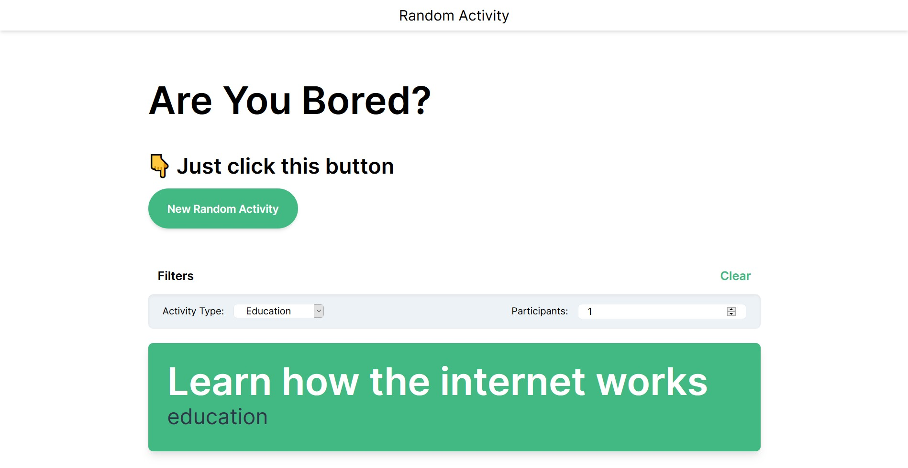

# Vue.js 3 Random Activity ⚡



A simple random activity generator app provided by the [Bored API](https://www.boredapi.com) built with the new Vue.js 3 + TailwindCSS + Docker

## Getting Started

Open your terminal then clone the repository

install the dependencies

```bash
# npm
$ npm install

# yarn
$ yarn
```

Run the app

```bash
# npm
$ npm run serve

# yarn
$ yarn serve
```

### Using docker 🐳

Build the image

```bash
$ docker build -t vue3-random-activity .
```

Run the container

```bash
$ docker run -it -p 8080:8080 vue3-random-activity
```

The app should be running on [http://localhost:8080](http://localhost:8080)